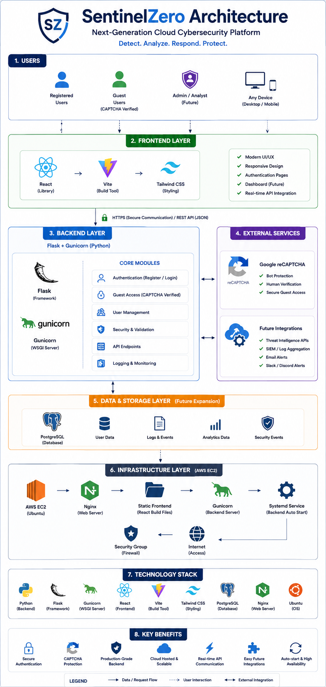

# 🛡️ SentinelZero

## 🚀 Overview

SentinelZero is a next-generation cloud cybersecurity platform designed to simulate a modern secure enterprise environment using:

- full-stack cloud deployment
- production-grade backend infrastructure
- secure authentication systems
- real-time API communication
- cloud-hosted frontend/backend architecture
- Linux production hosting
- Google reCAPTCHA verification
- enterprise deployment workflows

The platform demonstrates real-world:

- cloud engineering
- cybersecurity deployment
- Linux server management
- frontend/backend production architecture
- DevOps workflows
- secure cloud application hosting

Unlike tutorial-based projects, SentinelZero was fully deployed and debugged in a live AWS cloud environment using real production deployment tooling.

---

# 🎥 Live Demo Video

Watch the full project walkthrough and deployment demonstration here:

👉 ADD_YOUR_LOOM_VIDEO_LINK_HERE

The demo includes:

- full architecture walkthrough
- AWS EC2 deployment
- React frontend hosting
- Flask backend APIs
- Google reCAPTCHA integration
- secure guest authentication
- Gunicorn production server
- Nginx frontend hosting
- Linux backend services
- GitHub deployment workflow
- real-world debugging process

---

# 🌐 Live Deployment

## 🔥 Live Website

👉 http://50.17.5.214/

This deployment includes:

- React frontend
- Flask backend APIs
- Gunicorn production backend
- Nginx frontend hosting
- Google reCAPTCHA integration
- AWS EC2 Ubuntu deployment
- persistent backend Linux service

---

# ✅ Key Features

- ✅ Full-stack cloud deployment
- ✅ React + Flask architecture
- ✅ AWS EC2 production hosting
- ✅ Gunicorn production backend
- ✅ Nginx frontend hosting
- ✅ Persistent Linux backend service
- ✅ Auto-start backend on reboot
- ✅ Google reCAPTCHA guest verification
- ✅ User authentication system
- ✅ Account creation & login
- ✅ Secure API communication
- ✅ Production-grade deployment workflow
- ✅ GitHub-integrated deployment pipeline
- ✅ Real-world cloud debugging experience
- ✅ Secure cloud-hosted infrastructure
- ✅ Linux server management
- ✅ Production frontend/backend routing
- ✅ Public internet accessibility

---

# 🏗️ Architecture



```text
Users
   ↓
AWS EC2 Ubuntu Server
   ↓
Nginx Frontend Hosting
   ↓
React + Vite Frontend
   ↓
HTTPS / REST API Communication
   ↓
Gunicorn Production Server
   ↓
Flask Backend APIs
   ↓
Authentication + Security Modules
   ↓
Database / Threat Analytics / Logging
```

---

# ⚙️ Technology Stack

| Category | Technology |
|---|---|
| Frontend | React |
| Frontend Build Tool | Vite |
| Styling | Tailwind CSS |
| Backend | Flask |
| Production Backend | Gunicorn |
| Web Server | Nginx |
| Cloud Hosting | AWS EC2 |
| Operating System | Ubuntu Linux |
| CAPTCHA Security | Google reCAPTCHA |
| Deployment Workflow | Git + GitHub |
| API Communication | REST APIs |
| Authentication | Flask Auth System |
| Backend Language | Python |
| Frontend Language | JavaScript |
| Process Management | systemd |

---

# ☁️ Cloud Deployment

SentinelZero is fully deployed on:

- AWS EC2 Ubuntu Server
- Public cloud-hosted infrastructure
- Linux production environment
- Nginx frontend web server
- Gunicorn backend service
- systemd persistent backend management

Deployment architecture includes:

- public frontend hosting
- backend API routing
- secure frontend/backend communication
- Linux process management
- persistent backend hosting
- automatic backend restart
- production deployment workflows

---

# 🔐 Authentication System

SentinelZero includes:

- user registration
- secure login system
- guest access mode
- CAPTCHA-protected guest verification
- secure authentication routing

The platform integrates:

## ✅ Google reCAPTCHA

Features:

- “I’m not a robot” verification
- image-based CAPTCHA challenges
- bot prevention
- secure guest access validation

This improves:

- security
- abuse prevention
- authentication reliability
- production realism

---

# 🏗️ Production Infrastructure

The backend uses:

## ⚡ Gunicorn Production WSGI Server

instead of Flask development server.

Benefits:

- production-grade backend hosting
- multiple request handling
- persistent Linux hosting
- stable cloud deployment

---

## ⚡ systemd Linux Service

The backend runs as a permanent Linux service using:

```bash
sudo systemctl start sentinelzero
sudo systemctl enable sentinelzero
```

This enables:

- auto-start on reboot
- persistent backend hosting
- crash recovery
- production-style deployment

---

## ⚡ Nginx Frontend Hosting

Frontend build files are hosted using:

- Nginx
- static frontend serving
- production frontend deployment

---

# 🧠 Real-World Debugging Experience

During deployment, multiple real production issues were debugged and resolved, including:

- frontend/backend communication failures
- localhost deployment misconfiguration
- EC2 security group networking
- JSON parsing backend crashes
- Gunicorn worker memory issues
- Node.js version incompatibility
- Vite production build deployment
- GitHub deployment synchronization
- Linux service management
- cloud firewall configuration
- API routing failures
- browser caching issues
- production deployment troubleshooting

---

# 📊 Security Features

## 🛡️ Google reCAPTCHA Protection

SentinelZero integrates Google reCAPTCHA to secure guest access and prevent automated abuse.

Features include:

- human verification
- bot protection
- image-based challenge verification
- CAPTCHA-secured guest authentication

---

## 🔐 Secure Backend Infrastructure

Backend security includes:

- Gunicorn production hosting
- Linux process isolation
- secure API communication
- systemd-managed services
- production-grade backend deployment

---

## ☁️ Cloud Security

AWS deployment security includes:

- EC2 Security Groups
- Linux firewall architecture
- isolated backend services
- protected public access routing

---

# 📁 Project Structure

```text
sentinelzero-security-platform/
├── backend/
│   ├── app.py
│   ├── requirements.txt
│   ├── users.json
│   ├── auth_logs.json
│   └── venv/
│
├── frontend/
│   ├── src/
│   │   ├── App.jsx
│   │   ├── components/
│   │   └── assets/
│   │
│   ├── public/
│   ├── package.json
│   ├── vite.config.js
│   └── dist/
│
├── docs/
│   └── sentinelzero-architecture.png
│
├── README.md
└── .gitignore
```

---

# 🧪 How To Run

## 1. Clone Repository

```bash
git clone https://github.com/ayush-java/sentinelzero-security-platform.git

cd sentinelzero-security-platform
```

---

## 2. Setup Backend

```bash
cd backend

python3 -m venv venv

source venv/bin/activate

pip install -r requirements.txt
```

---

## 3. Start Backend

```bash
python3 app.py
```

Backend runs on:

```bash
http://localhost:5001
```

---

## 4. Setup Frontend

Open another terminal:

```bash
cd frontend

npm install
```

---

## 5. Start Frontend

```bash
npm run dev
```

Frontend runs on:

```bash
http://localhost:5173
```

---

# 🚀 Production Deployment Workflow

## Frontend Deployment

```bash
npm run build

sudo rm -rf /var/www/html/*

sudo cp -r dist/* /var/www/html/

sudo systemctl restart nginx
```

---

## Backend Deployment

```bash
sudo systemctl restart sentinelzero
```

---

## Backend Service Status

```bash
sudo systemctl status sentinelzero
```

---

## Live Backend Logs

```bash
journalctl -u sentinelzero -f
```

---

# 🎯 Learning Outcomes

This project demonstrates:

- cloud engineering
- AWS deployment
- Linux server management
- Nginx hosting
- Gunicorn backend deployment
- frontend/backend production architecture
- React deployment
- Flask API development
- GitHub deployment workflows
- cloud networking
- cybersecurity deployment practices
- CAPTCHA security integration
- production debugging
- DevOps workflows
- persistent backend infrastructure

---

# 📌 Future Improvements

Planned future upgrades:

- JWT authentication
- PostgreSQL database integration
- HTTPS + SSL deployment
- Docker containerization
- CloudWatch logging
- AWS WAF integration
- CI/CD GitHub Actions
- threat intelligence APIs
- SIEM analytics dashboard
- attack monitoring
- role-based access control
- Redis caching
- Nginx reverse proxy APIs
- live threat simulation engine

---

# 👤 Author

## Ayush Velhal

- Full-stack architecture & development
- AWS cloud deployment
- Linux production deployment
- Frontend/backend engineering
- DevOps workflow implementation
- Nginx & Gunicorn deployment
- CAPTCHA security integration
- Production debugging & infrastructure setup

---

# ⭐ Final Note

SentinelZero demonstrates a real-world cloud cybersecurity deployment pipeline by combining:

- cloud infrastructure
- secure authentication systems
- Linux production hosting
- frontend/backend deployment
- production web servers
- persistent backend services
- CAPTCHA security
- DevOps deployment workflows
- cloud networking
- real-world debugging

into a fully deployed next-generation cybersecurity platform hosted on AWS cloud infrastructure.