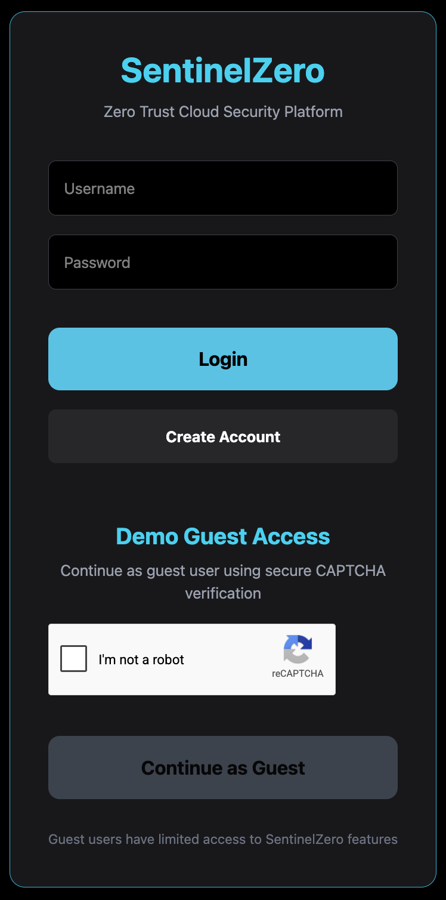
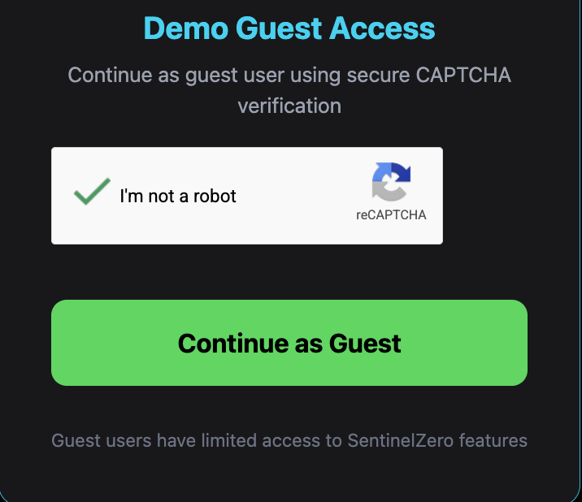
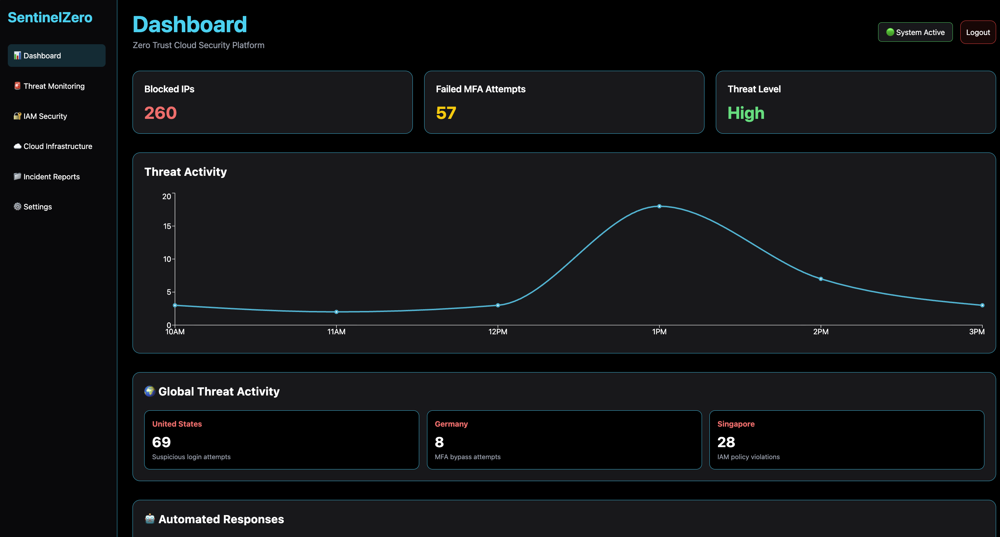
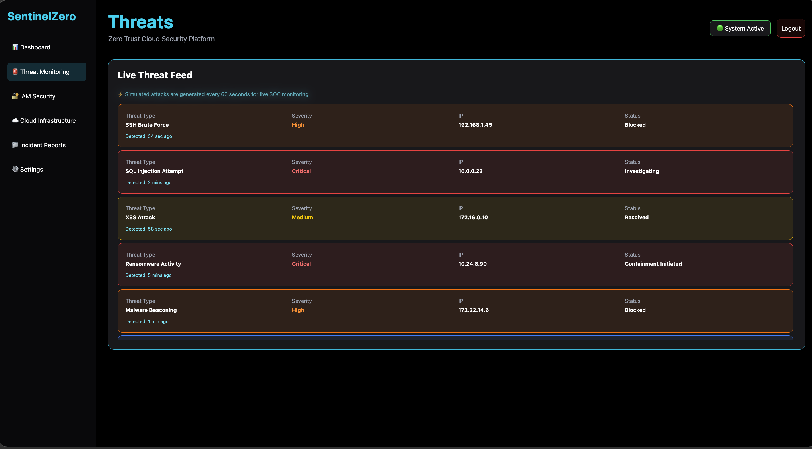
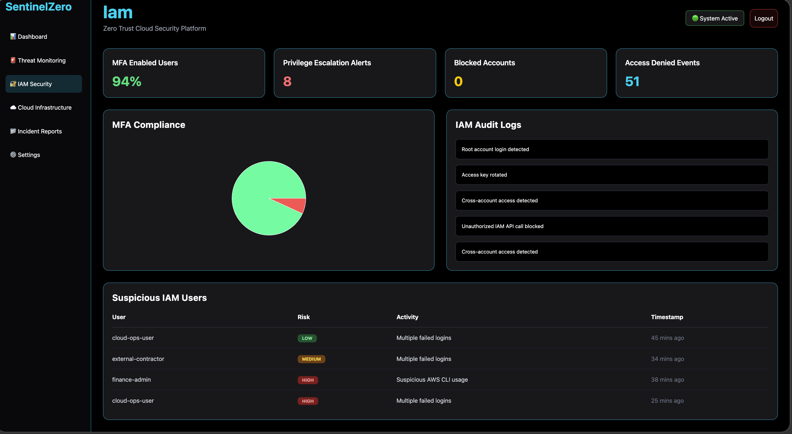
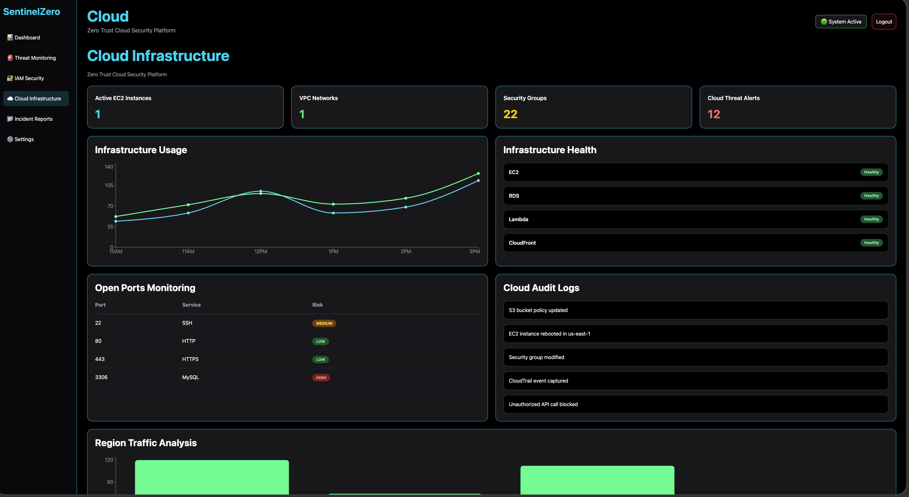
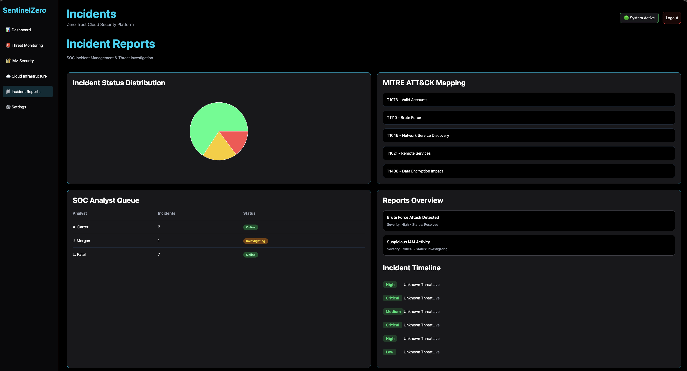
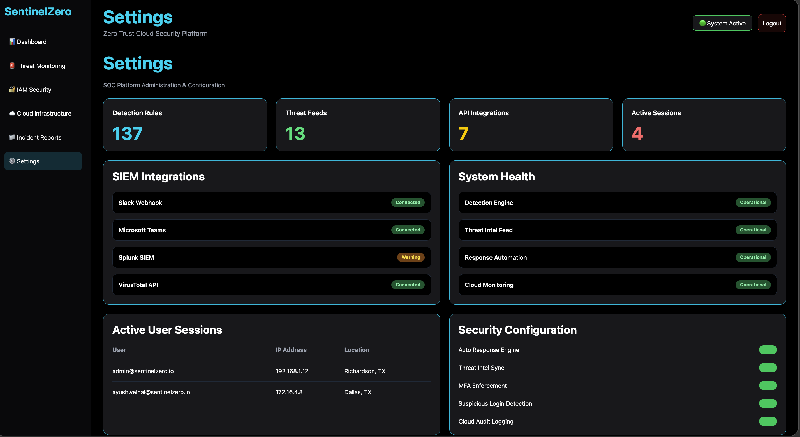

# 🛡️ SentinelZero

# 🚀 Next-Generation Cloud Cybersecurity Platform

🌐 LIVE DEPLOYMENT: https://sentinelzero.org

SentinelZero is a fully deployed enterprise-style cybersecurity platform built using:

- React
- Flask
- Gunicorn
- Nginx
- AWS EC2
- Cloudflare
- Linux
- Google reCAPTCHA
- HTTPS SSL Encryption

The platform demonstrates real-world:

- cloud engineering
- cybersecurity deployment
- Linux server administration
- production infrastructure
- secure frontend/backend communication
- DevOps deployment workflows
- reverse proxy configuration
- real-world debugging experience
- enterprise SOC dashboard engineering
- live threat monitoring
- IAM security visualization
- incident response workflows
- cloud infrastructure monitoring

---

# 🎥 Live Demo Video

Watch the full deployment walkthrough and project demonstration here:

👉 ADD_YOUR_LOOM_VIDEO_LINK_HERE

The demo includes:

- AWS EC2 deployment
- HTTPS custom domain setup
- Cloudflare DNS configuration
- React frontend hosting
- Flask backend APIs
- Nginx reverse proxy configuration
- Gunicorn production deployment
- Google reCAPTCHA integration
- secure authentication flow
- real-world debugging process
- GitHub deployment workflow
- live SOC dashboard walkthrough
- threat monitoring pages
- cloud security analytics
- IAM security monitoring
- incident response dashboards

---

# 🌐 Live Production Deployment

## 🔥 Live Website

👉 https://sentinelzero.org

---

# ⚡ Live Production Updates

SentinelZero is actively deployed and running in a live production cloud environment.

Live infrastructure includes:

- real-time frontend/backend communication
- persistent Linux backend services
- HTTPS SSL encryption
- Cloudflare DNS & protection
- live authentication workflows
- production reverse proxy routing
- secure cloud-hosted APIs
- public internet accessibility
- live dashboard analytics
- real-time threat visualization
- simulated SOC telemetry
- enterprise monitoring workflows

Deployment updates occur in real time through:

- GitHub push/pull workflows
- AWS EC2 deployment synchronization
- Nginx frontend deployment
- Gunicorn backend services
- Linux systemd automation

---

# ✅ Production Infrastructure

- ✅ Custom Domain Deployment
- ✅ HTTPS SSL Encryption
- ✅ Cloudflare CDN + DNS
- ✅ AWS EC2 Ubuntu Hosting
- ✅ React + Flask Architecture
- ✅ Gunicorn Production Backend
- ✅ Nginx Reverse Proxy
- ✅ systemd Backend Service
- ✅ Persistent Backend Hosting
- ✅ Google reCAPTCHA Integration
- ✅ Secure API Communication
- ✅ Production Deployment Workflow
- ✅ Public Cloud Deployment
- ✅ GitHub Deployment Pipeline
- ✅ Enterprise SOC Dashboards
- ✅ Live Threat Monitoring
- ✅ IAM Security Monitoring
- ✅ Cloud Infrastructure Analytics
- ✅ Incident Management System
- ✅ MITRE ATT&CK Visualization
- ✅ Real-Time Security Telemetry

---

# 🏗️ Architecture Diagram


```text
Users
   ↓
Cloudflare CDN + SSL
   ↓
HTTPS Secure Routing
   ↓
AWS EC2 Ubuntu Server
   ↓
Nginx Reverse Proxy
   ↓
React + Vite Frontend
   ↓
REST API Communication
   ↓
Gunicorn Production Server
   ↓
Flask Backend APIs
   ↓
Authentication + Security Layer
   ↓
Threat Analytics / Logging
```

---

# 🔐 Authentication System

SentinelZero includes:

- secure login system
- account creation
- guest access mode
- CAPTCHA-protected authentication
- secure frontend/backend communication

## 🔑 Login Page



The authentication interface provides:

- secure enterprise-style login UI
- guest access workflows
- real-time backend authentication
- protected frontend/backend communication
- production-ready user authentication design

---

# 🛡️ Google reCAPTCHA Protection

SentinelZero integrates Google reCAPTCHA to secure guest authentication and prevent automated abuse.

Features include:

- “I’m not a robot” verification
- image-based CAPTCHA challenges
- bot prevention
- secure guest access validation

This improves:

- authentication security
- abuse prevention
- production realism
- enterprise-grade protection

## 🤖 CAPTCHA Verification



The CAPTCHA system validates guest users before allowing dashboard access and simulates enterprise-grade authentication security controls used in modern cybersecurity platforms.

---

# 📊 Enterprise Security Dashboards

SentinelZero includes multiple enterprise-style cybersecurity dashboards designed to simulate a real SOC monitoring environment.

The platform features:

- live threat monitoring
- IAM security analytics
- cloud infrastructure visualization
- incident management workflows
- MITRE ATT&CK mapping
- security telemetry simulation
- automated response monitoring
- security operations analytics

---

# 🖥️ Main Dashboard



The main dashboard provides:

- blocked IP analytics
- threat activity graphs
- global threat monitoring
- automated security responses
- enterprise SOC visualization
- live monitoring telemetry

Features include:

- real-time dashboard updates
- security event visualization
- threat severity analytics
- cloud monitoring simulation
- automated SOC response tracking

---

# 🚨 Threat Monitoring Dashboard



The Threat Monitoring dashboard simulates a real-time enterprise threat feed displaying:

- SSH brute force attacks
- SQL injection attempts
- ransomware activity
- malware beaconing
- XSS attacks
- incident investigation workflows

Features include:

- live attack telemetry
- severity classification
- IP tracking
- incident response status
- simulated SOC investigations

---

# 🔐 IAM Security Dashboard



The IAM Security dashboard visualizes enterprise identity and access management security analytics.

Features include:

- MFA compliance monitoring
- privilege escalation alerts
- blocked account analytics
- suspicious IAM user tracking
- IAM audit logs
- access denied events
- cloud identity security analytics

This simulates enterprise IAM monitoring used in cloud security operations centers.

---

# ☁️ Cloud Infrastructure Dashboard



The Cloud Infrastructure dashboard monitors simulated cloud security telemetry and infrastructure health.

Features include:

- EC2 infrastructure monitoring
- VPC analytics
- security group monitoring
- cloud threat alerts
- infrastructure health status
- region traffic analytics
- cloud audit logging
- open ports monitoring

This dashboard demonstrates cloud-native infrastructure security visualization and operational monitoring.

---

# 📁 Incident Reports Dashboard



The Incident Reports dashboard simulates enterprise SOC incident response workflows.

Features include:

- incident status distribution
- MITRE ATT&CK mapping
- SOC analyst queue monitoring
- incident timelines
- investigation workflows
- severity classification
- threat response coordination

This demonstrates incident management workflows commonly used in enterprise security operations centers.

---

# ⚙️ Security Configuration Dashboard



The Settings dashboard simulates enterprise SOC configuration management and security operations administration.

Features include:

- SIEM integrations
- Splunk integration simulation
- VirusTotal API integrations
- Microsoft Teams integration
- Slack webhook integrations
- threat feed monitoring
- security automation configuration
- active session management
- cloud monitoring configuration

This demonstrates centralized enterprise security configuration management workflows.

---

# ⚙️ Technology Stack

| Category | Technology |
|---|---|
| Frontend | React |
| Frontend Build Tool | Vite |
| Styling | Tailwind CSS |
| Backend | Flask |
| Production Backend | Gunicorn |
| Reverse Proxy | Nginx |
| Cloud Hosting | AWS EC2 |
| DNS + SSL | Cloudflare |
| Operating System | Ubuntu Linux |
| CAPTCHA Security | Google reCAPTCHA |
| Deployment Workflow | Git + GitHub |
| API Communication | REST APIs |
| Authentication | Flask Auth System |
| Backend Language | Python |
| Frontend Language | JavaScript |
| Process Management | systemd |

---

# ☁️ Cloud Deployment

SentinelZero is fully deployed on AWS cloud infrastructure using a production-grade architecture.

## Deployment Stack

- AWS EC2 Ubuntu Server
- Nginx Reverse Proxy
- Gunicorn WSGI Server
- Flask Backend APIs
- React + Vite Frontend
- Cloudflare CDN + DNS
- HTTPS SSL Encryption
- Linux systemd Service Automation

---

# 🏗️ Production Infrastructure

## ⚡ Gunicorn Production WSGI Server

The backend uses Gunicorn instead of Flask’s development server.

Benefits include:

- production-grade hosting
- multiple request handling
- persistent backend services
- stable Linux deployment

---

## ⚡ systemd Linux Backend Service

The backend runs as a permanent Linux service using:

```bash
sudo systemctl start sentinelzero
sudo systemctl enable sentinelzero
```

This enables:

- automatic backend startup
- persistent hosting
- crash recovery
- production deployment behavior

---

## ⚡ Nginx Reverse Proxy

Nginx is configured as a production reverse proxy for:

- frontend hosting
- backend API routing
- HTTPS traffic handling
- secure request forwarding

---

# 🧠 Real-World Debugging Experience

During deployment, multiple real production issues were debugged and resolved, including:

- frontend/backend communication failures
- localhost deployment issues
- EC2 security group networking
- Cloudflare SSL configuration
- Nginx reverse proxy debugging
- Gunicorn backend deployment
- API routing failures
- HTTPS mixed-content issues
- reCAPTCHA domain validation
- Node.js version incompatibility
- GitHub deployment synchronization
- Linux service management
- browser caching issues
- cloud networking failures
- production deployment troubleshooting

---

# 📊 Security Features

## ☁️ Cloud Security

AWS deployment security includes:

- EC2 Security Groups
- Cloudflare protection
- HTTPS SSL encryption
- secure backend isolation
- protected public routing

---

## 🔐 Secure Backend Infrastructure

Backend security includes:

- Gunicorn production hosting
- Linux process isolation
- secure API communication
- systemd-managed services
- production-grade deployment

---

# 📁 Project Structure

```text
sentinelzero-security-platform/
├── backend/
│   ├── app.py
│   ├── requirements.txt
│   ├── users.json
│   ├── auth_logs.json
│   └── venv/
│
├── frontend/
│   ├── src/
│   │   ├── App.jsx
│   │   ├── components/
│   │   └── assets/
│   │
│   ├── public/
│   ├── package.json
│   ├── vite.config.js
│   └── dist/
│
├── docs/
│   ├── LoginPage.png
│   ├── CaptchaVerification.png
│   ├── Dashboard.png
│   ├── LiveThreat.png
│   ├── IAM_Page.png
│   ├── CloudInfrastructure.png
│   ├── Incidents.png
│   ├── Settings.png
│   └── sentinelzero-architecture.png
│
├── README.md
└── .gitignore
```

---

# 🧪 How To Run Locally

## 1. Clone Repository

```bash
git clone https://github.com/ayush-java/sentinelzero-security-platform.git

cd sentinelzero-security-platform
```

---

## 2. Setup Backend

```bash
cd backend

python3 -m venv venv

source venv/bin/activate

pip install -r requirements.txt
```

---

## 3. Start Backend

```bash
python3 app.py
```

Backend runs on:

```bash
http://localhost:5001
```

---

## 4. Setup Frontend

Open another terminal:

```bash
cd frontend

npm install
```

---

## 5. Start Frontend

```bash
npm run dev
```

Frontend runs on:

```bash
http://localhost:5173
```

---

# 🚀 Production Deployment Workflow

## Frontend Deployment

```bash
npm run build

sudo rm -rf /var/www/html/*

sudo cp -r dist/* /var/www/html/

sudo systemctl restart nginx
```

---

## Backend Deployment

```bash
sudo systemctl restart sentinelzero
```

---

## Backend Service Status

```bash
sudo systemctl status sentinelzero
```

---

## Live Backend Logs

```bash
journalctl -u sentinelzero -f
```

---

# 🎯 Learning Outcomes

This project demonstrates:

- cloud engineering
- AWS deployment
- Cloudflare configuration
- Linux server management
- Nginx reverse proxy configuration
- Gunicorn backend deployment
- frontend/backend production architecture
- React deployment
- Flask API development
- GitHub deployment workflows
- HTTPS SSL deployment
- cybersecurity deployment practices
- CAPTCHA security integration
- DevOps workflows
- persistent backend infrastructure
- production debugging
- enterprise SOC dashboard engineering
- cloud security analytics
- IAM monitoring workflows
- incident response visualization
- infrastructure security monitoring

---

# 🚀 Enterprise-Level Features

- Zero Trust Authentication
- Google reCAPTCHA Verification
- HTTPS SSL Encryption
- Cloudflare Protection
- Secure Guest Access
- Persistent Linux Backend Services
- Reverse Proxy Infrastructure
- Cloud-Native Deployment
- Real-Time Backend APIs
- Production-Grade Architecture
- Enterprise Security Dashboards
- IAM Security Monitoring
- Incident Response Workflows
- Cloud Infrastructure Analytics
- Live Threat Monitoring
- MITRE ATT&CK Visualization
- SOC Security Operations Simulation

---

# 📌 Future Improvements

Planned future upgrades:

- JWT authentication
- PostgreSQL database integration
- Docker containerization
- CloudWatch logging
- AWS WAF integration
- CI/CD GitHub Actions
- threat intelligence APIs
- SIEM analytics dashboard
- attack monitoring
- role-based access control
- Redis caching
- live threat simulation engine

---

# 👤 Author

## Ayush Velhal

- Full-stack architecture & development
- AWS cloud deployment
- Linux production deployment
- Frontend/backend engineering
- Cloudflare & HTTPS configuration
- Nginx reverse proxy implementation
- Gunicorn production backend setup
- CAPTCHA security integration
- Production debugging & infrastructure setup
- Enterprise dashboard engineering
- Cloud security analytics implementation
- SOC workflow simulation
- IAM monitoring visualization

---

# ⭐ Final Note

SentinelZero demonstrates a real-world cloud cybersecurity deployment pipeline by combining:

- cloud infrastructure
- secure authentication systems
- HTTPS SSL encryption
- Cloudflare protection
- Linux production hosting
- frontend/backend deployment
- Nginx reverse proxy routing
- production web servers
- persistent backend services
- CAPTCHA security
- DevOps deployment workflows
- cloud networking
- enterprise SOC dashboards
- IAM security analytics
- cloud infrastructure monitoring
- incident response visualization
- threat monitoring workflows
- real-world debugging

into a fully deployed next-generation cybersecurity platform hosted on AWS cloud infrastructure.