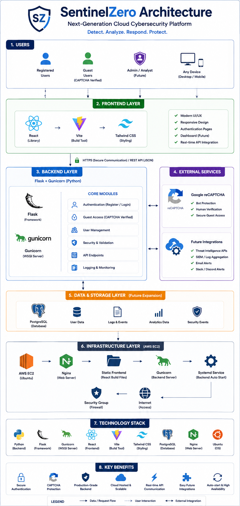
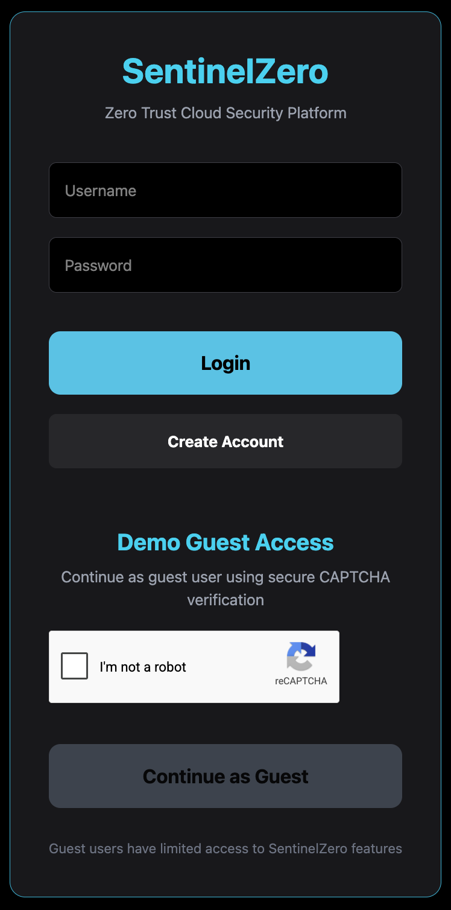
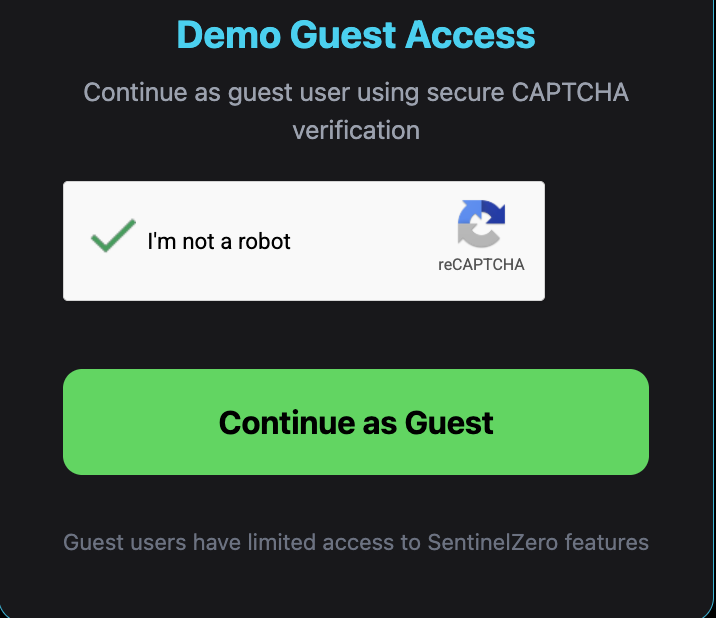
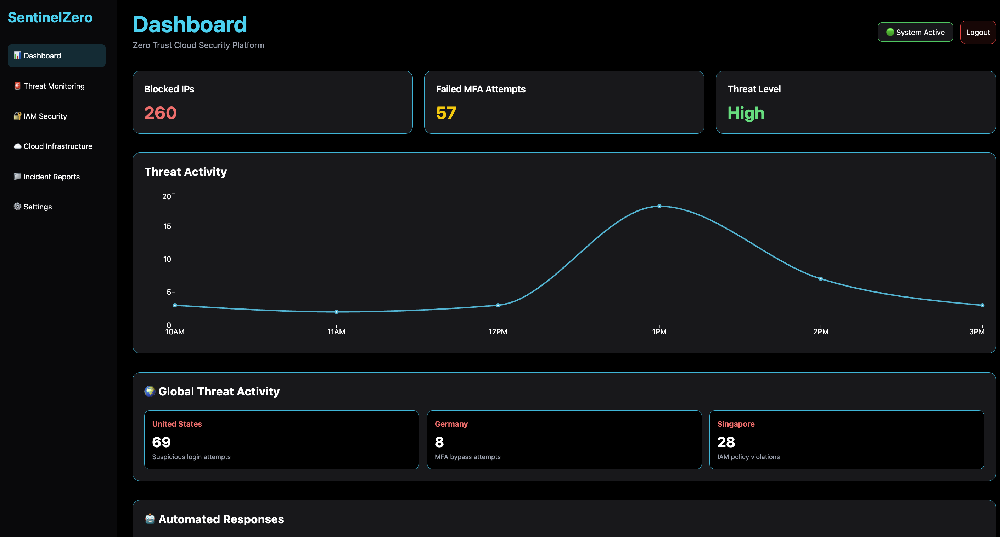
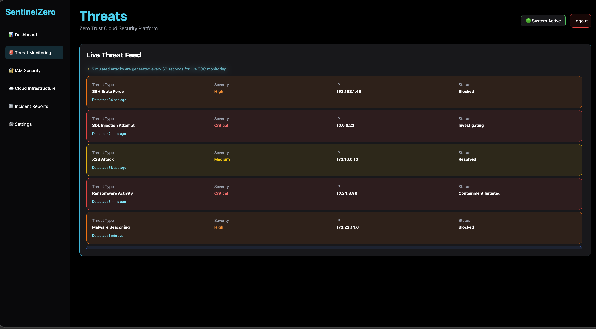
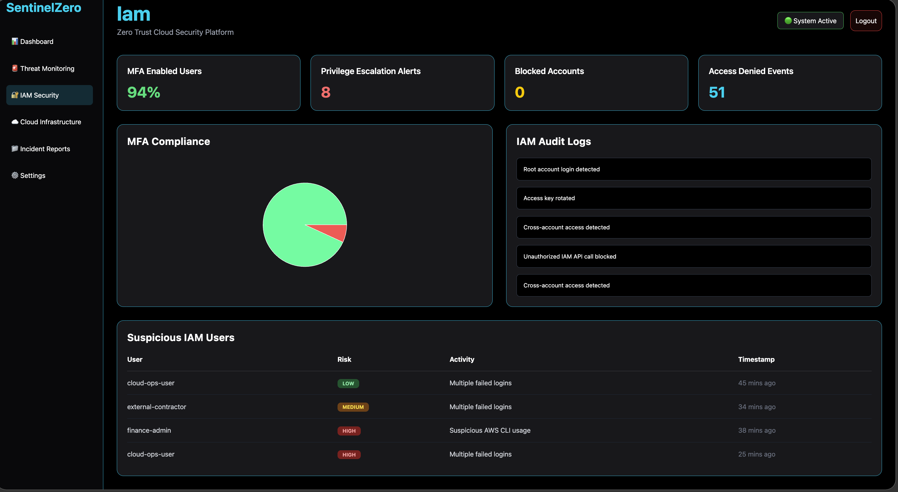
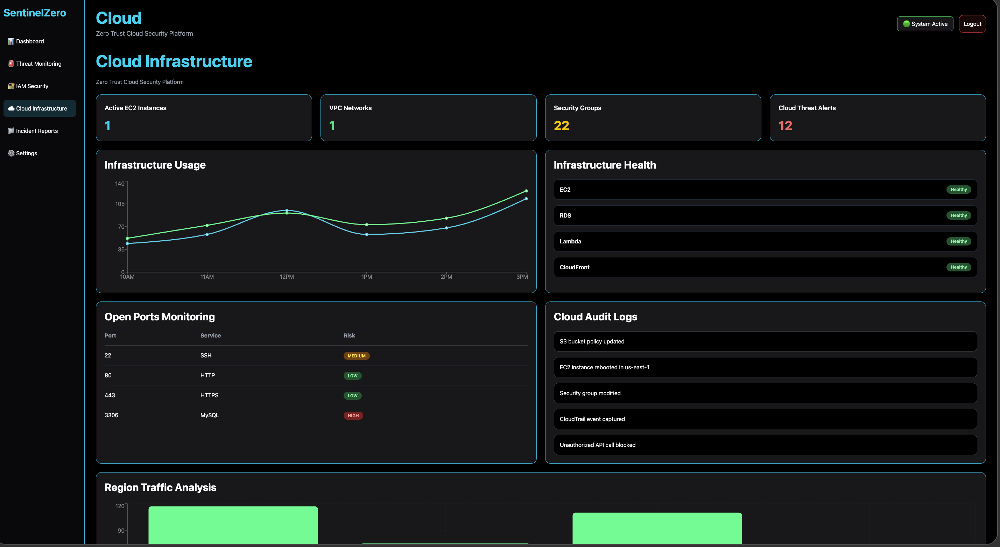
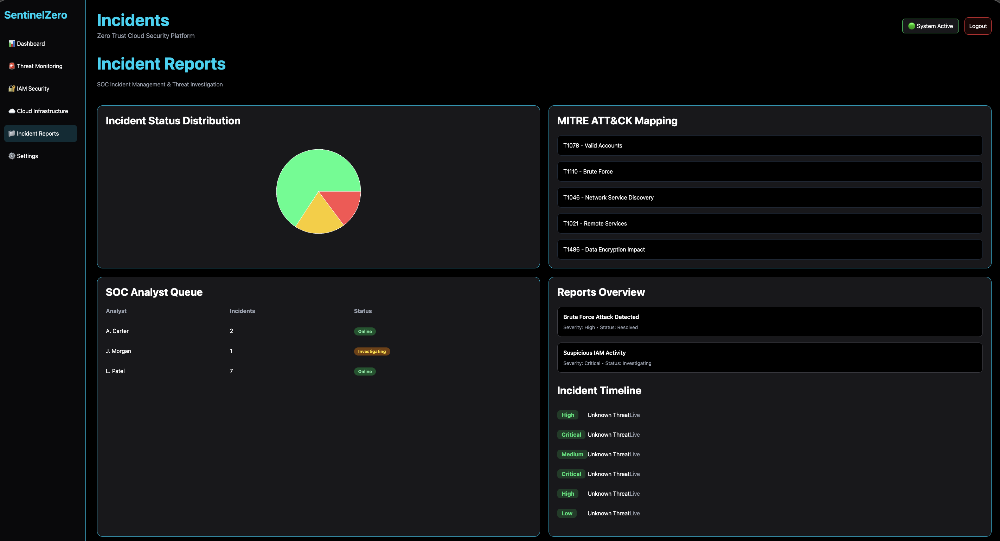
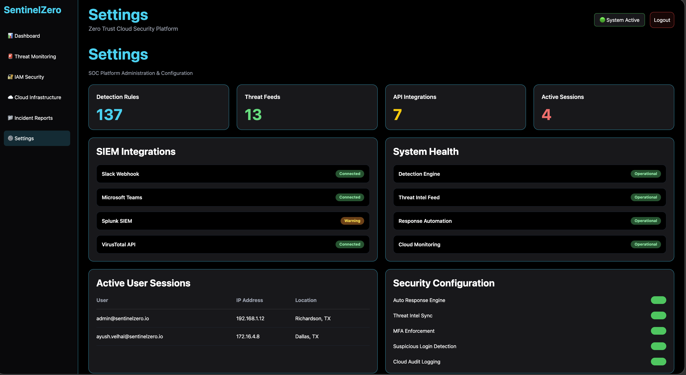

# 🛡️ SentinelZero

## 🚀 Overview

SentinelZero is a cloud-hosted cybersecurity platform designed to simulate enterprise security operations and cloud security monitoring workflows.

Built with React, Flask, AWS, Nginx, Gunicorn, and Cloudflare, the platform demonstrates real-world cloud deployment, secure authentication, threat monitoring, IAM security analytics, and incident response visualization.

### Key Features

* Real-time threat monitoring
* Secure authentication system
* Google reCAPTCHA protection
* IAM security analytics
* Incident management dashboards
* Cloud infrastructure monitoring
* MITRE ATT&CK visualization
* AWS cloud deployment
* HTTPS SSL encryption
* Cloudflare protection

---

## 🎥 Demo Video

🔗 Demo Link: https://drive.google.com/file/d/1Aj9uH7YNeO7xPedi3bCC1cajCEQVPjVy/view?usp=sharing

---

## 🌐 Live Deployment

👉 https://sentinelzero.org/

---

## 🏗️ Architecture

---

## ⚙️ Technology Stack

| Category          | Technology       |
| ----------------- | ---------------- |
| Frontend          | React + Vite     |
| Backend           | Flask            |
| Production Server | Gunicorn         |
| Reverse Proxy     | Nginx            |
| Cloud Hosting     | AWS EC2          |
| DNS & SSL         | Cloudflare       |
| Authentication    | Google reCAPTCHA |
| OS                | Ubuntu Linux     |
| APIs              | REST             |
| Version Control   | GitHub           |

---

# 📊 Platform Screenshots

## Login & Authentication

---

## Security Dashboard

---

## Threat Monitoring

---

## IAM Security Analytics

---

## Cloud Infrastructure Monitoring

---

## Incident Management

---

## Security Configuration

---

## 🔐 Security Features

* HTTPS SSL Encryption
* Cloudflare Protection
* Google reCAPTCHA Verification
* Secure Guest Access
* Nginx Reverse Proxy
* Gunicorn Production Backend
* Linux systemd Services
* Secure Frontend ↔ Backend Communication

---

## ☁️ Cloud Deployment

SentinelZero is fully deployed on AWS using:

* AWS EC2 Ubuntu Server
* Nginx Reverse Proxy
* Gunicorn Application Server
* React Frontend
* Flask Backend APIs
* Cloudflare DNS & SSL
* Linux systemd Service Management

---

## 🧠 Real-World Experience Demonstrated

* AWS Cloud Deployment
* Linux Server Administration
* Cloudflare Configuration
* HTTPS SSL Setup
* Nginx Reverse Proxy Configuration
* Production Flask Deployment
* React Frontend Hosting
* Secure Authentication Design
* Cloud Security Monitoring
* Incident Response Visualization
* Enterprise Dashboard Development

---

## 👤 Author

**Ayush Velhal**

Designed and developed independently, including cloud deployment, frontend/backend engineering, Linux server administration, Cloudflare configuration, authentication workflows, and cybersecurity dashboard development.
